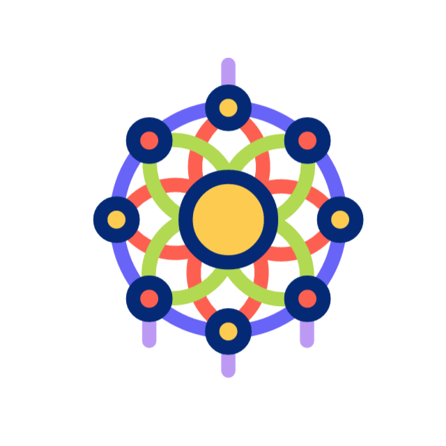

<h1 align="center" style="text-decoration">👋 Hi!</h1>

<h2 align="center">I’m Tran Ngoc Hieu </h2>

###

Fresh out of college with a <strong>Bachelor’s degree</strong> in <strong>Information Technology – Website Development</strong>, and now kicking off my journey as a <strong>Fresher Fullstack Developer</strong> at <strong>EZ Active Vietnam</strong> 🎉  I love turning ideas into real web apps, playing around with both frontend & backend stuff, and always curious to learn the next cool thing in tech ✨

###

  

###

###

---

###

<h2 align="center" style="font-size: 32px"> <strong>My Skills</strong> </h2>

###

<h3 align="center">Techstacks</h3>

###

  
  
  
  
  
  
  
  
  
  
  
  
  
  
  
  
  
  
  

###

<h3 align="center">Development Tools</h3>

###

  
  
  
  
  
  
  
  
  
  
  
  
  
  
  
  
  

###

<h3 align="center">Office & Design Tools</h3>

###

  
  
  
  
  
  
  
  
  
  

###

---

###

###

<h2 align="center" style="font-size: 32px"> <strong>Activities</strong> </h2>

###

###

  

###

###

---

###

###

<h2 align="center" style="font-size: 32px"> <strong>Connect with me</strong> </h2>

###

###

  
  
  
  

###
